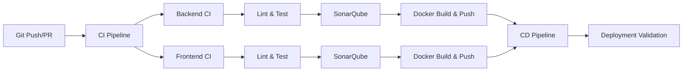

# Uni DevOps Projekt – SS25

## 📚 Inhaltsverzeichnis

-   [🎯 Projektübersicht](#-projektübersicht)
-   [🏗️ Architektur & Technologie-Stack](#️-architektur--technologie-stack)
-   [⚙️ CI/CD Pipeline](#️-cicd-pipeline)
-   [📦 Helm Charts & Infrastructure as Code](#-helm-charts--infrastructure-as-code)
-   [🏷️ Versionierung & Container-Management](#️-versionierung--container-management)
-   [🚀 Deployment Anleitungen](#-deployment-anleitungen)
    -   [Quick Start](#quick-start)
    -   [Docker Deployment](#docker-deployment)
    -   [Kubernetes/Minikube Deployment](#kubernetesminikube-deployment)
-   [🔧 Troubleshooting](#-troubleshooting)

---

## 🎯 Projektübersicht

Dieses DevOps-Projekt implementiert eine **Fullstack-Webanwendung** zur Verwaltung einer Physiotherapie-Praxis. Das Hauptziel war es, moderne DevOps-Praktiken in einem praxisnahen Szenario umzusetzen und dabei den gesamten Software-Lebenszyklus abzubilden.

### 🎓 Lernziele & DevOps-Praktiken

-   **Containerisierung**: Docker für einheitliche Deployment-Umgebungen
-   **Orchestrierung**: Kubernetes mit Helm für skalierbare Infrastructure as Code
-   **CI/CD**: GitHub Actions für automatisierte Build-, Test- und Deployment-Pipelines
-   **Code Quality**: Statische Analyse mit SonarQube, Linting und Testing
-   **Monitoring**: Health Checks und Application Observability

---

## 🏗️ Architektur & Technologie-Stack

### 📋 Technologie-Entscheidungen

| Bereich            | Technologie                     | Begründung                                           |
| ------------------ | ------------------------------- | ---------------------------------------------------- |
| **Backend**        | Spring Boot 3 + Java 21         | Robustes Enterprise-Framework, moderne Java-Features |
| **Frontend**       | Next.js 14 + React + TypeScript | SSR/SSG, optimale Performance, Type Safety           |
| **Datenbank**      | PostgreSQL                      | ACID-Konformität, robuste Relational DB              |
| **Container**      | Docker                          | Portabilität, einheitliche Umgebungen                |
| **Orchestrierung** | Kubernetes + Helm               | Skalierbarkeit, deklarative Konfiguration            |
| **CI/CD**          | GitHub Actions                  | Native Integration, kostenlos für OSS                |
| **Code Quality**   | SonarQube                       | Umfassende statische Analyse                         |

### 🔄 System-Architektur

```
┌─────────────────────────────────────────────────────────────┐
│                    Client (Browser)                         │
└─────────────────────┬───────────────────────────────────────┘
                      │ HTTP/HTTPS
┌─────────────────────▼───────────────────────────────────────┐
│                NGINX Ingress Controller                     │
│              (Load Balancer & SSL Termination)              │
└─────────────────────┬───────────────────────────────────────┘
                      │
        ┌─────────────┴─────────────┐
        │                           │
┌───────▼─────────┐        ┌────────▼────────┐
│   Next.js       │        │   Spring Boot   │
│   Frontend      │◄──────►│   REST API      │
│   Port: 3000    │   API  │   Port: 8080    │
│                 │ Calls  │                 │
└─────────────────┘        └────────┬────────┘
                                    │ JDBC
                           ┌────────▼────────┐
                           │   PostgreSQL    │
                           │   Database      │
                           │   Port: 5432    │
                           └─────────────────┘
```

---

## ⚙️ CI/CD Pipeline

Die **GitHub Actions** Pipeline implementiert moderne DevOps-Praktiken mit automatisierten Build-, Test-, und Quality-Gates. Das Setup folgt dem Prinzip "Shift Left" – Probleme werden so früh wie möglich im Entwicklungsprozess erkannt.

### 🔄 Pipeline-Übersicht



### 🔄 Continuous Integration (CI) - `fullstack-ci.yml`

Die CI-Pipeline startet in der aktuellen Implementierung automatisch bei **Push** oder **Pull Request** und führt parallele Jobs für Backend und Frontend aus. In einem Produktiv-System sollten spezifischere Regeln genutzt werden um wirklich nur die Teile der Anwendung neu zu Bauen, welche sich auch wirklich geändert haben:

#### **Backend CI-Pipeline**

1. **Setup & Caching**:

    - Java 21 (Temurin Distribution)
    - Maven Dependencies caching für schnellere Builds
    - PostgreSQL 15.3 Test-Container mit Health Checks

2. **Build, Test & Quality**:

    ```bash
    ./mvnw clean verify checkstyle:check
    ```

    - Unit Tests (JUnit)
    - Integration Tests mit TestContainers
    - Checkstyle für Code-Style Compliance
    - JaCoCo für Code Coverage

3. **SonarQube Analyse**:

    - Statische Code-Analyse
    - Code Coverage Integration (JaCoCo XML Reports)
    - Test-Results Upload (Surefire & Failsafe Reports)

4. **Container Build**:
    - JAR-Artefakt Upload für nachgelagerte Jobs
    - Docker Image Build & Push zu Docker Hub
    - Multi-Tag Strategy: `:latest` und `:$GITHUB_SHA`

#### **Frontend CI-Pipeline**

1. **Setup & Dependencies**:

    - Node.js 20
    - npm Dependencies caching
    - `npm ci` für deterministische Installs

2. **Code Quality & Testing**:

    ```bash
    npx eslint . --ext .js,.jsx,.ts,.tsx
    npx stylelint "**/*.{css,scss}"
    npm run test -- --coverage
    ```

    - ESLint für JavaScript/TypeScript
    - Stylelint für CSS/SCSS
    - Jest Tests mit Coverage Reports

3. **SonarQube Integration**:

    - Frontend-spezifische Code-Analyse
    - Coverage Reports Integration

4. **Production Build**:
    - Next.js Build (`npm run build`)
    - Docker Image mit optimiertem Production Bundle
    - Multi-Stage Dockerfile für minimale Image-Größe

### 🚀 Continuous Deployment (CD) - `fullstack-cd.yml`

Die CD-Pipeline wird **manuell über GitHub UI** gestartet und führt End-to-End Tests in isolierter Umgebung durch. Über ein Input-Parameter kann die Version des Docker Images ausgewählt werden, welche zum Deployment genutzt werden soll ("Version der Anwendung"). Das Versionierungskonzept ist später in der README beschrieben:

#### **Deployment-Strategie**

```bash
# Manuelle Trigger mit Version-Parameter
workflow_dispatch:
  inputs:
    version: "latest" | "fb83cc3" # SHA oder Tag
```

#### **Test-Infrastruktur Setup**

1. **Docker Network erstellen**: Isolierte Test-Umgebung, ermöglicht Kommuniktation zwischen Teilen der Anwendung
2. **PostgreSQL starten**: Echte Datenbank für Integrationstests
3. **Backend Container**: Mit DB-Verbindung über Docker Network
4. **Frontend Container**: Mit Backend-API Verbindung

#### **Automatisierte Validierung**

1. **Health Checks**:

    ```bash
    curl http://localhost:8080/actuator/health
    # Wartet auf {"status":"UP"}
    ```

2. **Funktionale Tests**:

    - **Login-API Test**: POST `/api/v1/auth/authenticate`
    - **Response Validation**: Prüft `accessToken` und `userId`
    - **Frontend Rendering**: HTML-Struktur Validierung
    - **UI Content Check**: Spezifische Inhalte wie "Hallo Körperschmiede"

3. **Cleanup**:
    - Container werden nach Tests automatisch entfernt
    - Kein persistenter Zustand (Ephemeral Testing)

### 🔧 Pipeline-Features

#### **Parallelisierung & Effizienz**

-   Backend und Frontend Jobs laufen parallel
-   Dependency Caching reduziert Build-Zeiten
-   `continue-on-error: true` für Linter (non-blocking, sollte im Prduktiv-System sehr wahrscheinlich so nicht genutzt werden)

#### **Sicherheit & Secrets**

-   Docker Hub Credentials via GitHub Secrets
-   SonarQube Token Management
-   Keine Hardcoded Credentials in Code

### 📊 Quality Gates

-   **Backend**: Maven Tests + Checkstyle + SonarQube
-   **Frontend**: Jest Tests + ESLint + Stylelint + SonarQube
-   **Coverage**: JaCoCo (Backend) & Jest (Frontend) Reports
-   **SonarQube**: Definierte QualityGates in SonarQube

---

## 📦 Helm Charts & Infrastructure as Code

Als Bonus für die Projektarbeit habe ich versucht, **Helm Charts** für deklaratives und wiederverwendbares Kubernetes-Deployment zu benutzen.
Helm fungiert als "Package Manager" für Kubernetes und ermöglicht es, komplexe Anwendungen mit Templates und konfigurierbaren Werten zu verwalten.

### 🎯 Warum Helm?

-   **Wiederverwendbarkeit**: Ein Chart für mehrere Umgebungen (dev, staging, prod)
-   **Versionierung**: Chart-Versionen für rollback-fähige Deployments
-   **Konfiguration**: Trennung von Code und Umgebungsspezifischen Werten
-   **Dependencies**: Automatisches Management von Abhängigkeiten (z.B. PostgreSQL)

### 🏗️ Chart-Struktur

Das Projekt enthält zwei separate Helm Charts, da die Hauptanwendung auch aus zwei Teilen besteht:

```
charts/
├── backEnd/           # Backend (Spring Boot) Chart
│   ├── Chart.yaml     # Chart-Metadaten
│   ├── values.yaml    # Standardkonfiguration
│   └── templates/     # Kubernetes-Manifeste
│       ├── deployment.yml
│       ├── service.yaml
│       └── ingress.yaml
└── frontend/          # Frontend (Next.js) Chart
    ├── Chart.yaml
    ├── values.yaml
    └── templates/
        ├── deployment.yaml
        ├── service.yaml
        └── ingress.yaml
```

### 🔧 Backend Chart (`charts/backEnd/`)

#### **Chart.yaml** – Chart-Metadaten

```yaml
apiVersion: v2
name: backend
description: A Helm chart for the backend service
type: application
version: 0.1.0
appVersion: "1.0.0"
```

#### **values.yaml** – Konfigurierbare Werte

Das Backend Chart verwendet folgende konfigurierbare Parameter:

-   **`replicaCount: 1`** – Anzahl der Pod-Replikas
-   **`image.repository`** – Docker Image Repository (`richardprax/devops-github-backend`)
-   **`image.tag: latest`** – Image-Tag (in CI/CD wird dies mit dem Git-SHA überschrieben)
-   **`service.type: ClusterIP`** – Service-Typ (intern im Cluster erreichbar)
-   **`service.port: 8080`** – Service-Port
-   **`ingress.enabled: true`** – Ingress aktiviert für externen Zugriff
-   **`ingress.host: backend.local`** – Hostname für den externen Zugriff
-   **`database.*`** – PostgreSQL-Verbindungsparameter

#### **Templates – Kubernetes-Ressourcen**

1. **Deployment** (`templates/deployment.yml`):

    - Erstellt einen Pod mit dem Spring Boot Container
    - Umgebungsvariablen für Datenbankverbindung werden aus `values.yaml` injiziert
    - Container lauscht auf Port 8080

2. **Service** (`templates/service.yaml`):

    - Typ: `ClusterIP` (nur intern erreichbar)
    - Mapped Port 8080 des Services auf Port 8080 des Containers
    - Selector: `app: backend`

3. **Ingress** (`templates/ingress.yaml`):
    - Ermöglicht externen HTTP-Zugriff über `backend.local`
    - Nutzt NGINX Ingress Controller
    - Leitet Traffic an den Backend-Service weiter

### 💻 Frontend Chart (`charts/frontend/`)

#### **values.yaml** – Konfiguration

-   **`replicaCount: 1`** – Ein Frontend-Pod
-   **`image.repository`** – Docker Image (`richardprax/devops-github-frontend`)
-   **`service.port: 3000`** – Next.js Standard-Port
-   **`ingress.host: frontend.local`** – Hostname für die Web-UI
-   **`app.apiUrl`** – Backend API URL (konfigurierbar für verschiedene Umgebungen)

#### **Templates**

1. **Deployment** (`templates/deployment.yaml`):

    - Next.js Container auf Port 3000
    - **Environment Variables**: Dynamische API-URL-Konfiguration über `NEXT_PUBLIC_API_URL`
    - Ermöglicht flexibles Deployment in verschiedenen Umgebungen

2. **Service** (`templates/service.yaml`):

    - ClusterIP Service für Port 3000

3. **Ingress** (`templates/ingress.yaml`):
    - Externe Erreichbarkeit über `frontend.local`

### 🌐 Netzwerk-Architektur

```
[Browser]
    ↓ (HTTP)
[NGINX Ingress Controller]
    ↓
[frontend.local] → [Frontend Service:3000] → [Frontend Pod:3000]
[backend.local]  → [Backend Service:8080]  → [Backend Pod:8080]
                                                      ↓ (JDBC)
                                            [PostgreSQL Service:5432]
```

### 🔧 Erweiterte Konfiguration

#### **API URL Konfiguration**

Das Frontend kann für verschiedene Umgebungen konfiguriert werden, ohne Code-Änderungen:

**Kubernetes Development (`charts/frontend/values-development.yaml`)**:

```yaml
app:
    apiUrl: "http://backend:8080" # Interner Service-Name
```

**Production (`charts/frontend/values-production.yaml`)**:

```yaml
app:
    apiUrl: "https://api.example.com" # Externe API URL
```

#### **Verschiedene Umgebungen**

Für verschiedene Umgebungen können separate Values-Dateien erstellt werden:

```bash
# Development
helm install frontend ./charts/frontend -f charts/frontend/values-development.yaml

# Production
helm install backend ./charts/backEnd -f values-prod.yaml
```

---

## 🏷️ Versionierung & Container-Management

---

### 🏷️ Image-Tagging Strategie

Im Rahmen dieses Projekts werden Docker Images mit dem **SHA des jeweiligen Commits** getaggt (`:SHA`).  
Dadurch wird sichergestellt, dass keine Images überschrieben werden und jede Pipeline ein eigenes, reproduzierbares Artefakt erzeugt.

#### **Warum SHA-basierte Tags?**

1. **Eindeutigkeit**: Jeder Commit erzeugt ein eindeutiges Image
2. **Reproduzierbarkeit**: Exakte Nachvollziehbarkeit welcher Code deployed wurde
3. **Rollback-Fähigkeit**: Einfache Rückkehr zu vorherigen Versionen
4. **Parallel Development**: Verschiedene Branches überschreiben sich nicht

#### **Tag-Beispiele**

```bash
# Commit-spezifische Tags
richardprax/devops-github-frontend:fb83cc3
richardprax/devops-github-backend:a1b2c3d

# Zusätzlich: Latest Tag für aktuelle Entwicklung
richardprax/devops-github-frontend:latest
richardprax/devops-github-backend:latest

# Spezielle Helm Tags für lokales Kubernetes Deployments
richardprax/devops-github-frontend:latest-helm
richardprax/devops-github-backend:latest (verwendet für Helm)
```

#### **Frontend Image Varianten**

Das Projekt erstellt **zwei verschiedene Frontend Images** für unterschiedliche Deployment-Szenarien:

1. **Standard Image** (`:latest`):
    - API URL: `http://localhost:8080`
    - Verwendung: Docker Compose, lokale Entwicklung, Deployment Validation in der Pipeline
2. **Helm Image** (`:latest-helm`):
    - API URL: `http://backend.local`
    - Verwendung: Kubernetes/Minikube Deployments
    - Ermöglicht Service-zu-Service Kommunikation über Ingress

Diese Trennung ist notwendig, da Next.js die API URL zur **Build-Zeit** festlegt und nicht zur Laufzeit geändert werden kann.

### 🐳 Container-Strategie

#### **Multi-Stage Dockerfiles**

Beide Services nutzen optimierte Multi-Stage Builds:

**Backend (Spring Boot)**:

```dockerfile
# Build Stage
FROM openjdk:21-jdk-slim as builder
COPY . .
RUN ./mvnw clean package -DskipTests

# Runtime Stage
FROM openjdk:21-jre-slim
COPY --from=builder target/*.jar app.jar
ENTRYPOINT ["java", "-jar", "app.jar"]
```

Die Build Stage ist hier nur exemplarisch mit aufgeführt, der Build Prozess wird in der Pipeline separat ausgeführt.

**Frontend (Next.js)**:

```dockerfile
# Install dependencies only when needed
FROM node:20-alpine AS deps
RUN apk add --no-cache libc6-compat
WORKDIR /app
COPY package.json package-lock.json* ./
RUN npm ci

# Rebuild the source code only when needed
FROM node:20-alpine AS builder
WORKDIR /app
COPY --from=deps /app/node_modules ./node_modules
COPY . .

# Add build argument for API URL
ARG NEXT_PUBLIC_API_URL=http://localhost:8080
ENV NEXT_PUBLIC_API_URL=$NEXT_PUBLIC_API_URL

RUN npm run build

# Production image, copy all the files and run next
FROM node:20-alpine AS runner
WORKDIR /app

ENV NODE_ENV production

RUN addgroup --system --gid 1001 nodejs
RUN adduser --system --uid 1001 nextjs

COPY --from=builder /app/public ./public

COPY --from=builder --chown=nextjs:nodejs /app/.next/standalone ./
COPY --from=builder --chown=nextjs:nodejs /app/.next/static ./.next/static

USER nextjs

EXPOSE 3000

ENV PORT 3000

CMD ["node", "server.js"]

```

#### **Optimierungen**

-   **Layer Caching**: Dependencies werden separat kopiert
-   **Minimale Base Images**: Alpine Linux für kleinere Image-Größen
-   **Security**: Non-root User für Runtime
-   **Health Checks**: Container-native Health Endpoints

---

## 🚀 Deployment Anleitungen

Dieser Abschnitt bietet praktische Anleitungen für verschiedene Deployment-Szenarien – vom schnellen lokalen Start bis hin zum produktionsreifen Kubernetes-Setup.

### Quick Start

#### Voraussetzungen

-   Docker & Docker Compose
-   Helm 3+ (für Kubernetes)
-   Minikube (für lokales K8s)

#### Schnellstart mit Docker

```bash
# 1. Repository klonen
git clone https://github.com/RichardPrax/uni-devops-ss-25.git
cd uni-devops-ss-25

# 2. PostgreSQL starten
docker run -d --name postgres \
  -e POSTGRES_DB=koerperschmiede \
  -e POSTGRES_USER=admin \
  -e POSTGRES_PASSWORD=admin \
  -p 5432:5432 postgres:15.3

# 3. Backend starten
docker run -d --name backend \
  -e SPRING_DATASOURCE_URL=jdbc:postgresql://host.docker.internal:5432/koerperschmiede \
  -e SPRING_DATASOURCE_USERNAME=admin \
  -e SPRING_DATASOURCE_PASSWORD=admin \
  -p 8080:8080 richardprax/devops-github-backend:latest

# 4. Frontend starten
docker run -d --name frontend \
  -e NEXT_PUBLIC_API_URL=http://host.docker.internal:8080 \
  -p 3000:3000 richardprax/devops-github-frontend:latest
```

#### Zugriff

-   **Frontend**: http://localhost:3000
-   **Backend API**: http://localhost:8080
-   **Health Check**: http://localhost:8080/actuator/health

---

### Docker Deployment - Weg 2

#### 🔧 Voraussetzungen

-   Docker (inkl. Docker Daemon)
-   PostgreSQL läuft entweder lokal oder via Docker Compose (siehe unten)

#### 📋 Schritt-für-Schritt Anleitung

##### 🧱 Backend starten

1. Stelle sicher, dass PostgreSQL auf Port `5432` läuft  
   (siehe `backEnd/docker-compose.yml`)
2. Starte das Backend:

```bash
docker run -d \
 --name backend-container \
 -e SPRING_DATASOURCE_URL=jdbc:postgresql://host.docker.internal:5432/koerperschmiede \
 -e SPRING_DATASOURCE_USERNAME=admin \
 -e SPRING_DATASOURCE_PASSWORD=admin \
 -p 8080:8080 \
 richardprax/devops-github-backend:latest
```

##### 💻 Frontend starten

1. Starte die DB und das Backend
2. Dann das Frontend:

```bash
docker run -d \
  --name frontend-container \
  -e NEXT_PUBLIC_API_URL=http://host.docker.internal:8080 \
  -p 3000:3000 \
  richardprax/devops-github-frontend:latest
```

#### ✅ Validierung

```bash
# Backend Health Check
curl http://localhost:8080/actuator/health

# Frontend Erreichbarkeit
curl http://localhost:3000
```

---

### Kubernetes/Minikube Deployment

Die nachfolgenden Anweisungen beschreiben die Schritte, welche auszuführen sind um das Deployment via Kubernetes lokal auf einem Unix basiertem Betriebssystem zu starten.
Anpassungen an andere Betriebssysteme sind spezifisch bei Abschnitt 3 vorzunehmen.
Da ich dieses Projekt auf meinem Laptop bearbeite, auf welchem Ubuntu läuft, habe ich keine weiteren Konfigurationen angegeben.

#### ✅ Voraussetzungen

-   Minikube
-   Helm (mind. v3)

#### 📦 Setup & Deployment

##### 1. **Minikube initialisieren**

```bash
# Option 1: Docker-Treiber (Standard, erfordert Port-Forward)
# Docker muss gestartet sein
minikube start

# Option 2: VirtualBox-Treiber (IP direkt erreichbar)
# ist die Option welche ich im Rahmen des Uni-Projektes bevorzugt habe
minikube start --driver=virtualbox
```

**Wichtiger Hinweis:**

-   **Docker-Treiber**: Schnell, aber Minikube läuft in isoliertem Netzwerk → **Port-Forward erforderlich**
-   **VirtualBox-Treiber**: IP direkt vom Host erreichbar → **Direkte URLs funktionieren**

##### 2. **Ingress aktivieren**

```bash
minikube addons enable ingress
```

##### 3. **Hosts-Datei konfigurieren**

```bash
# Minikube IP ermitteln
minikube ip

# Hosts-Datei aktualisieren (IP entsprechend anpassen)
echo "{MINIKUBE_IP} backend.local frontend.local" | sudo tee -a /etc/hosts
```

##### 4. **Helm Repository einrichten**

```bash
helm repo add bitnami https://charts.bitnami.com/bitnami
helm repo update
```

##### 5. **PostgreSQL installieren (WICHTIG: Zuerst)**

```bash
helm install my-postgres bitnami/postgresql \
  --set auth.postgresPassword=admin \
  --set auth.database=koerperschmiede \
  --set auth.username=admin \
  --set auth.password=admin
```

⚠️ **Warte bis PostgreSQL bereit ist, bevor du mit den nächsten Schritten fortfährst:**

```bash
# Warten bis PostgreSQL Pod läuft
kubectl wait --for=condition=ready pod -l app.kubernetes.io/name=postgresql --timeout=300s
```

##### 6. **Application Services deployen (REIHENFOLGE BEACHTEN)**

```bash
# 1. Backend deployen (braucht PostgreSQL)
helm install backend ./charts/backEnd

# Warten bis Backend bereit ist
kubectl wait --for=condition=ready pod -l app=backend --timeout=300s

# 2. Frontend deployen (braucht Backend)
helm install frontend ./charts/frontend --set image.tag=latest-helm
```

⚠️ **Wichtiger Hinweis:** Für Helm Deployments verwende das spezielle Frontend Image mit `latest-helm` Tag, das für `backend.local` API URLs vorkonfiguriert ist.

##### 7. **Deployment validieren**

```bash
# Optional: kubectl Alias setzen
alias kubectl="minikube kubectl --"

# Alle Pods sollten den Status "Running" haben
kubectl get pods, svc, ingress -o wide
```

#### 🌐 Zugriff auf die Anwendung

**Bei VirtualBox-Treiber (Direkte URLs):**

-   **Frontend**: http://frontend.local
-   **Backend API**: http://backend.local
-   **PostgreSQL**: Via Port-Forward `kubectl port-forward svc/my-postgres-postgresql 5432:5432`

**Bei Docker-Treiber (Port-Forward erforderlich):**

```bash
# Port-Forward zum Ingress Controller einrichten
kubectl port-forward --namespace=ingress-nginx service/ingress-nginx-controller 8080:80

# In einem neuen Terminal testen:
curl -H "Host: backend.local" http://localhost:8080/actuator/health
curl -H "Host: frontend.local" http://localhost:8080/

# Browser öffnen mit:
# http://localhost:8080 (Ingress Controller leitet automatisch weiter)
```

#### 🔐 Login & Zugriff

Nach erfolgreichem Deployment kannst du die Anwendung wie folgt nutzen:

1. **Hauptseite aufrufen**:

    - VirtualBox: http://frontend.local
    - Docker: http://localhost:8080 (mit Port-Forward)

2. **Admin Login**:

    - URL: http://frontend.local/login (oder http://localhost:8080/login)
    - **Benutzername**: `admin@admin.com`
    - **Passwort**: `test`

3. **Benutzer Login**:
    - **Benutzername**: `user@user.com`
    - **Passwort**: `test`

ℹ️ **Hinweis**: Die Test-Benutzer werden automatisch durch Liquibase beim ersten Start der Backend-Anwendung erstellt.

**Hinweis**: Bei Docker-Treiber läuft Minikube in einem isolierten Docker-Netzwerk, weshalb Port-Forward notwendig ist.

#### 🔍 Helm Troubleshooting

**Häufige Deployment-Probleme:**

```bash
# Chart-Status prüfen
helm list

# Detaillierte Informationen
helm status backend
helm status frontend

# Pod-Status und Logs prüfen
kubectl get pods -o wide
kubectl logs -l app=backend
kubectl logs -l app=frontend

# Ingress Status prüfen
kubectl get ingress
kubectl describe ingress backend-ingress
kubectl describe ingress frontend-ingress
```

**Deployment-Reihenfolge Problem:**

-   ❌ Frontend startet vor Backend → API-Verbindung fehlgeschlagen
-   ✅ PostgreSQL → Backend → Frontend (mit Warten zwischen den Schritten)

**Falsches Frontend Image:**

-   ❌ `latest` Tag → API calls gehen an `localhost:8080`
-   ✅ `latest-helm` Tag → API calls gehen an `backend.local`

### Komplettes Neu-Deployment

#### Logs anzeigen

```bash
kubectl logs -l app=backend
kubectl logs -l app=frontend
```

#### Pods und Services prüfen

```bash
kubectl get pods,svc,ingress
```

#### Chart deinstallieren

```bash
helm uninstall backend
helm uninstall frontend
helm uninstall my-postgres
```

#### Hard Reset

```bash
minikube delete
```

---

## 🔧 Troubleshooting

### 🐳 Docker Issues

#### Container startet nicht

```bash
# Logs anzeigen
docker logs backend-container
docker logs frontend-container

# Container Status prüfen
docker ps -a

# Ports prüfen
netstat -tulpn | grep :8080
netstat -tulpn | grep :3000
```

#### Datenbankverbindung

```bash
# PostgreSQL Container prüfen => Passwort: admin
docker exec -it postgres psql -U admin -d koerperschmiede

# Netzwerk-Connectivity testen
docker exec backend-container curl postgres:5432
```

### ☸️ Kubernetes/Minikube Issues

#### Pods starten nicht

```bash
# Pod Details anzeigen
kubectl describe pod <pod-name>

# Logs anzeigen
kubectl logs <pod-name> -f

# Events prüfen
kubectl get events --sort-by=.metadata.creationTimestamp
```

#### Ingress nicht erreichbar

```bash
# Ingress Controller Status
kubectl get pods -n ingress-nginx

# Prüfen ob Ingress Add-on aktiviert ist
minikube addons list | grep ingress

# Ingress Add-on aktivieren falls nicht aktiv
minikube addons enable ingress

# Warten bis Ingress Controller bereit ist (kann 1-2 Minuten dauern)
kubectl wait --namespace ingress-nginx \
  --for=condition=ready pod \
  --selector=app.kubernetes.io/component=controller \
  --timeout=90s

# Ingress-Ressourcen prüfen (ADDRESS sollte nicht leer sein)
kubectl get ingress

# DNS/Hosts Konfiguration prüfen
nslookup backend.local
nslookup frontend.local

# LÖSUNG für Docker-Treiber: Port-Forward verwenden
kubectl port-forward --namespace=ingress-nginx service/ingress-nginx-controller 8080:80
# Dann testen: curl -H "Host: backend.local" http://localhost:8080/actuator/health

# LÖSUNG für VirtualBox-Treiber: Cluster neu starten
minikube stop && minikube delete
minikube start --driver=virtualbox
# Dann: minikube ip und diese IP in /etc/hosts eintragen
```

#### Image Pull Errors

```bash
# Image lokal in Minikube laden
minikube image load richardprax/devops-github-backend:latest
minikube image load richardprax/devops-github-frontend:latest

# Registry Secrets prüfen
kubectl get secrets
```

### 🔄 CI/CD Issues

#### Pipeline Fails

```bash
# GitHub Actions Logs in der Web-UI prüfen
# Häufige Probleme:
# - Docker Hub Rate Limits
# - SonarQube Token abgelaufen
# - Test-Dependencies fehlen
# - Secrets abgelaufen
```

#### SonarQube Probleme

```bash
# Token validieren
curl -u $SONAR_TOKEN: $SONAR_HOST_URL/api/authentication/validate

# Projekt-Key prüfen
curl -u $SONAR_TOKEN: $SONAR_HOST_URL/api/projects/search
```

### 🚨 Häufige Probleme

| Problem                       | Lösung                                                       |
| ----------------------------- | ------------------------------------------------------------ |
| Port bereits belegt           | `docker stop $(docker ps -q)` oder anderen Port verwenden    |
| Image nicht gefunden          | Tag prüfen: `docker images`                                  |
| Minikube IP ändert sich       | Hosts-Datei neu konfigurieren                                |
| Helm Installation fehlschlägt | `helm uninstall` und erneut versuchen                        |
| PostgreSQL Connection Timeout | Container-Reihenfolge beachten (DB → Backend → Frontend)     |
| Services nicht erreichbar     | Docker-Treiber: Port-Forward nutzen, VirtualBox: Direkte IPs |
| Ingress zeigt keine ADDRESS   | Warte bis Ingress Controller bereit ist (1-2 Min)            |

---
